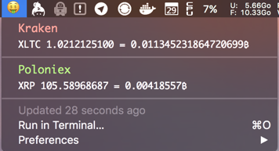

# Cryptobar
BitBar plugin that check every given time the current status of your currencies in [Kraken](https://kraken.com), [Poloniex](https://poloniex.com) or [Bittrex](https://bittrex.com)



### How to install
```
git clone https://github.com/johnoppenheimer/cryptobar.git
cd cryptobar
npm install
```

### Adding your API Keys
I will assume that you have you keys from Kraken or Poloniex. Open `config.js` and add your keys like that:
```javascript
module.exports = {
    platforms: {
        kraken: {
            key: "mySuperKey",
            secret: "mySuperSecret"
        },
        poloniex: {
            key: "mySuperKey",
            secret: "mySuperSecret"
        }
    }
}
```

### Configuration with BitBar
BitBar will try to read files that won't work (like a nice package.json), so to avoid that you can create a folder in your home (like `~/.bitbar`), and create symbolic link to `cryptobar.js` like:
```
ln -s /path/to/the/repo/cryptobar.js ~/.bitbar/plugins/cryptobar.30s.js
```
The `30s` in the filename is important because it say to BitBar what is the refresh rate

Then you need to set the plugins path to BitBar
```
defaults write com.matryer.BitBar pluginsDirectory "~/.bitbar/plugins"
```
Quit and relaunch BitBar and you should be good!

### LICENSE
MIT